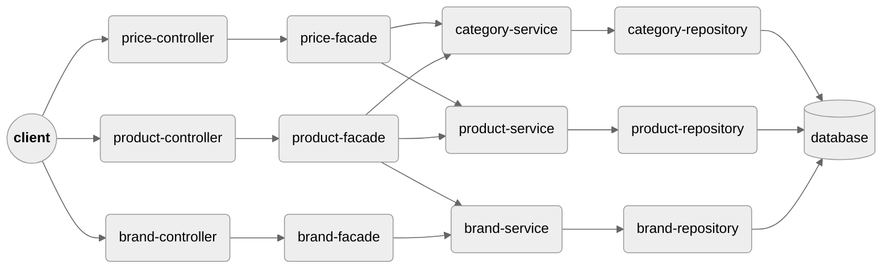
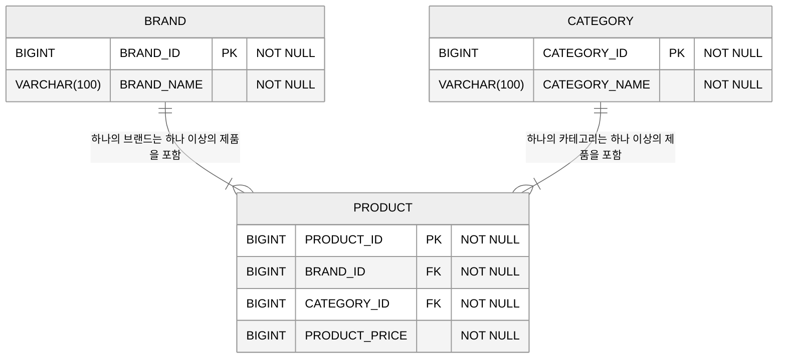
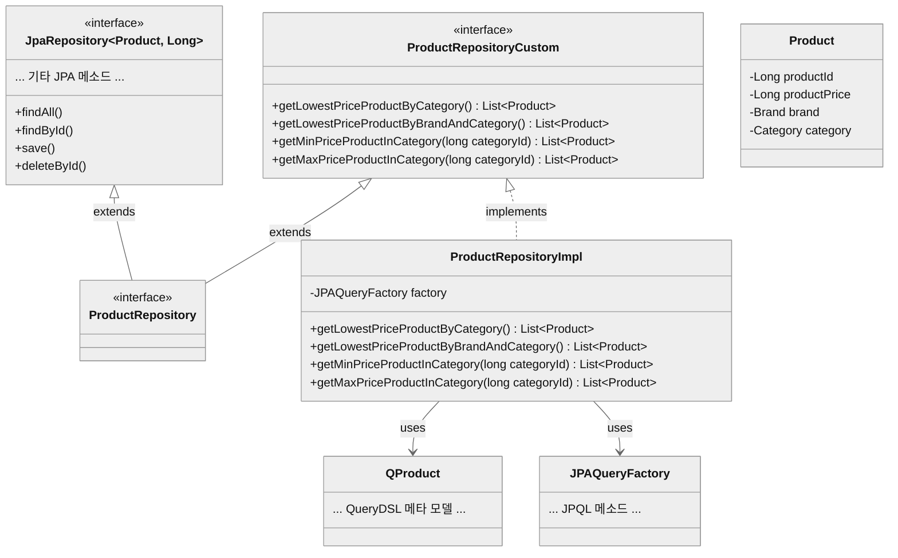

# [MUSINSA] Java(Kotlin) Backend Engineer - 과제
## 구현 설명
### 프로젝트 구조
- 연관 서비스 간 상호작용을 단일 인터페이스로 간소화하여 코드 가독성과 유지보수성을 높이기 위해<br/>기본적인 레이어드 아키텍처에 퍼사드 패턴을 적용했습니다.
- 퍼사드는 서비스를 통하여 각 서비스에 대응하는 데이터에 접근합니다.

### ER 다이어그램
기능 요구사항을 충족하기 위한 최소한의 데이터 구조를 생각했습니다.

### QueryDSL
JPA 쿼리 메서드와 QueryDSL의 기능을 함께 사용하기 위한 코드를 작성했습니다.

### Caffeine
Caffeine을 이용해 퍼사드 레이어에서 가격 집계 응답을 캐시하고 상품 갱신 시 캐시를 무효화합니다.
- [CachePolicy](./src/main/java/com/musinsa/subject/config/CachePolicy.java)
- [PriceFacadeImpl](./src/main/java/com/musinsa/subject/service/facade/impl/PriceFacadeImpl.java)
- [ProductFacadeImpl](./src/main/java/com/musinsa/subject/service/facade/impl/ProductFacadeImpl.java)
### MapStruct
MapStruct를 이용해 퍼사드 레이어에서 엔티티를 VO로 전환합니다.
- [PriceMapper](./src/main/java/com/musinsa/subject/mapper/PriceMapper.java)
- [ProductMapper](./src/main/java/com/musinsa/subject/mapper/ProductMapper.java)
- [BrandMapper](./src/main/java/com/musinsa/subject/mapper/BrandMapper.java)
### Spock
Spock을 이용해 BDD(Behavior-Driven Development) 기반 단위 테스트를 구현했습니다.
- [PriceFacadeSpec](./src/test/groovy/com/musinsa/subject/service/facade/PriceFacadeSpec.groovy)
- [ProductFacadeSpec](./src/test/groovy/com/musinsa/subject/service/facade/ProductFacadeSpec.groovy)
- [BrandFacadeSpec](./src/test/groovy/com/musinsa/subject/service/facade/BrandFacadeSpec.groovy)
### 예외 처리
RestControllerAdvice를 이용해 사용자 정의 예외를 핸들링하고 실패 사유를 전달합니다.
- [ExceptionAdvice](./src/main/java/com/musinsa/subject/exception/ExceptionAdvice.java)
- [DomainExceptionType](./src/main/java/com/musinsa/subject/exception/DomainExceptionType.java)
- [InternalExceptionType](./src/main/java/com/musinsa/subject/exception/InternalExceptionType.java)
## 빌드 / 실행 방법
### JAR
**JAR 빌드**
```shell 
./gradlew build
```
**JAR 실행**
```shell 
java -jar build/libs/musinsa-subject-0.0.1-SNAPSHOT.jar
```
### Docker
**이미지 빌드**
```shell
docker build -t musinsa-subject:latest .
```
**이미지 실행**
```shell
docker run -p 8080:8080 musinsa-subject:latest
```
## 테스트 방법
**카테고리 별 최저가격 브랜드와 상품 가격, 총액을 조회하는 API**
```shell
curl -X GET 'http://localhost:8080/prices/category-lowest-price'
```
**단일 브랜드로 모든 카테고리 상품을 구매할 때 최저가격에 판매하는 브랜드와 카테고리의 상품가격, 총액을
조회하는 API**
```shell
curl -X GET 'http://localhost:8080/prices/lowest-total-price-brand'
```
**카테고리 이름으로 최저, 최고 가격 브랜드와 상품 가격을 조회하는 API**
```shell
curl -X GET 'http://localhost:8080/prices/min-max-price-brand?categoryName=%EC%83%81%EC%9D%98'
```
**브랜드 및 상품을 추가 / 업데이트 / 삭제하는 API**
```shell
# 브랜드 추가
curl -X POST 'http://localhost:8080/brands' \
  -H 'Content-Type: application/json' \
  -d '{ "brandName": "Z" }'
```
```shell
# 브랜드 업데이트
curl -X PATCH 'http://localhost:8080/brands/10' \
  -H 'Content-Type: application/json' \
  -d '{ "brandName": "X" }'
```
```shell
# 브랜드 삭제
curl -X DELETE 'http://localhost:8080/brands/10'
```
```shell
# 상품 추가
curl -X POST 'http://localhost:8080/products' \
  -H 'Content-Type: application/json' \
  -d '{ "productPrice": 10000, "brandId": 1, "categoryId": 1 }'
```
```shell
# 상품 업데이트
curl -X PATCH 'http://localhost:8080/products/73' \
  -H 'Content-Type: application/json' \
  -d '{ "productPrice": 30000, "brandId": 1, "categoryId": 1 }'
```
```shell
# 상품 삭제
curl -X DELETE 'http://localhost:8080/products/73'
```
## 참고
### API 문서
어플리케이션 실행 후 루트 도메인 접근 시 Swagger UI 페이지로 리다이렉션됩니다.
### 용어 사용
최저가만 조회하는 경우 `lowest`, 최저가와 최고가를 함께 조회하는 경우 `min`,`max` 사용했습니다.
### 데이터 초기화
준비된 데이터는 다음과 같으며 `local` 프로필 환경에서 [DataInitializer](./src/main/java/com/musinsa/subject/config/DataInitializer.java)에 의해 초기화됩니다.

| 브랜드 | 상의 | 아우터 |  바지  | 스니커즈 |  가방  |  모자  | 양말  | 액세서리 |
|------|-----|-------|-------|-------|-------|-------|-------|-------|
| A | 11,200 | 5,500 | 4,200 | 9,000 | 2,000 | 1,700 | 1,800 | 2,300 |
| B | 10,500 | 5,900 | 3,800 | 9,100 | 2,100 | 2,000 | 2,000 | 2,200 |
| C | 10,000 | 6,200 | 3,300 | 9,200 | 2,200 | 1,900 | 2,200 | 2,100 |
| D | 10,100 | 5,100 | 3,000 | 9,500 | 2,500 | 1,500 | 2,400 | 2,000 |
| E | 10,700 | 5,000 | 3,800 | 9,900 | 2,300 | 1,800 | 2,100 | 2,100 |
| F | 11,200 | 7,200 | 4,000 | 9,300 | 2,100 | 1,600 | 2,300 | 1,900 |
| G | 10,500 | 5,800 | 3,900 | 9,000 | 2,200 | 1,700 | 2,100 | 2,000 |
| H | 10,800 | 6,300 | 3,100 | 9,700 | 2,100 | 1,600 | 2,000 | 2,000 |
| I | 11,400 | 6,700 | 3,200 | 9,500 | 2,400 | 1,700 | 1,700 | 2,400 |