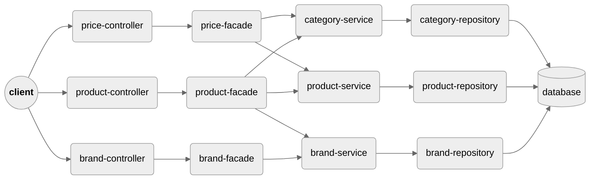
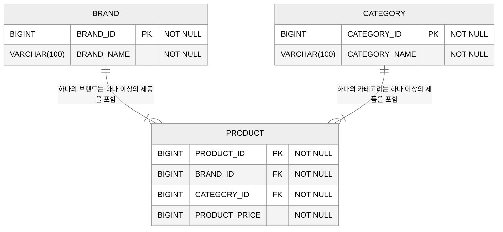
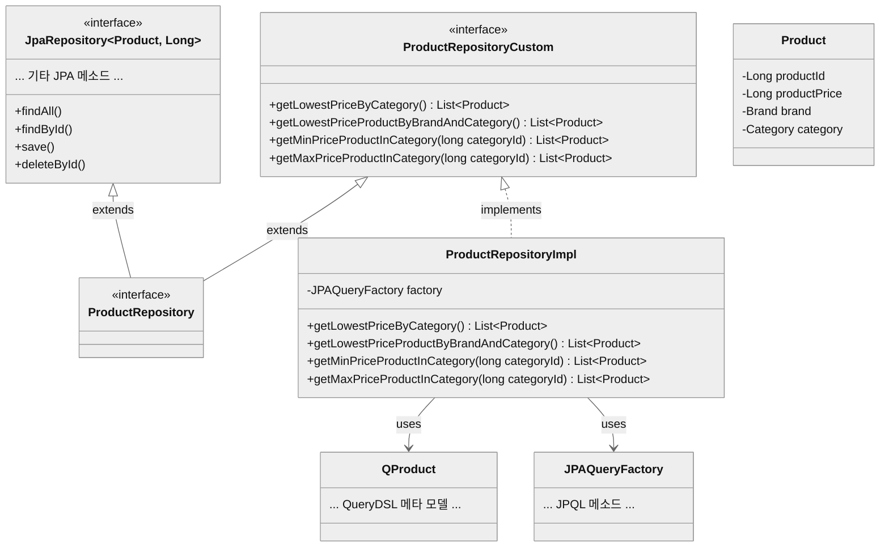

# [MUSINSA] Java(Kotlin) Backend Engineer - 과제
## 구현 설명
### 프로젝트 구조
- 기본적인 레이어드 아키텍처에 퍼사드 패턴을 적용했습니다.
- 퍼사드는 서비스를 통하여 각 서비스에 대응하는 데이터에 접근합니다.

```mermaid
%%{init: {'theme': 'neutral'}}%%
graph LR
    client(("`**client**`"))
    
    price-controller(price-controller)
    product-controller(product-controller)
    brand-controller(brand-controller)
    
    price-facade(price-facade)
    product-facade(product-facade)
    brand-facade(brand-facade)
    
    category-service(category-service)
    product-service(product-service)
    brand-service(brand-service)
    
    category-repository(category-repository)
    product-repository(product-repository)
    brand-repository(brand-repository)
    
    database[(database)]
    
    client --> price-controller
    client --> product-controller
    client --> brand-controller

    price-controller --> price-facade
    product-controller --> product-facade
    brand-controller --> brand-facade

    price-facade --> category-service
    price-facade --> product-service
    product-facade --> category-service
    product-facade --> product-service
    product-facade --> brand-service
    brand-facade --> brand-service

    category-service --> category-repository
    product-service --> product-repository
    brand-service --> brand-repository

    category-repository --> database
    product-repository --> database
    brand-repository --> database
```
### ER 다이어그램
기능 요구사항을 충족하기 위한 최소한의 데이터 구조를 생각했습니다.

```mermaid
%%{init: {'theme': 'neutral'}}%%
erDiagram
    BRAND {
        BIGINT BRAND_ID PK "NOT NULL"
        VARCHAR(100) BRAND_NAME "NOT NULL"
    }
    CATEGORY {
        BIGINT CATEGORY_ID PK "NOT NULL"
        VARCHAR(100) CATEGORY_NAME "NOT NULL"
    }
    PRODUCT {
        BIGINT PRODUCT_ID PK "NOT NULL"
        BIGINT BRAND_ID FK "NOT NULL"
        BIGINT CATEGORY_ID FK "NOT NULL"
        BIGINT PRODUCT_PRICE "NOT NULL"
    }

    BRAND ||--|{ PRODUCT : "하나의 브랜드는 하나 이상의 제품을 포함"
    CATEGORY ||--|{ PRODUCT : "하나의 카테고리는 하나 이상의 제품을 포함"
```
### QueryDSL
JPA 쿼리 메서드와 QueryDSL의 기능을 함께 사용하기 위한 코드를 작성했습니다.

```mermaid
%%{init: {'theme': 'neutral'}}%%
classDiagram
    class JpaRepository~Product, Long~ {
    <<interface>>
    +findAll()
    +findById()
    +save()
    +deleteById()
    ... 기타 JPA 메소드 ...
    }
    
    class ProductRepository {
    <<interface>>
    }
    
    class ProductRepositoryCustom {
    <<interface>>
    +getLowestPriceByCategory() List~Product~
    +getLowestPriceProductByBrandAndCategory() List~Product~
    +getMinPriceProductInCategory(long categoryId) List~Product~
    +getMaxPriceProductInCategory(long categoryId) List~Product~
    }
    
    class ProductRepositoryImpl {
    -JPAQueryFactory factory
    +getLowestPriceByCategory() List~Product~
    +getLowestPriceProductByBrandAndCategory() List~Product~
    +getMinPriceProductInCategory(long categoryId) List~Product~
    +getMaxPriceProductInCategory(long categoryId) List~Product~
    }

    class Product {
    -Long productId
    -Long productPrice
    -Brand brand
    -Category category
    }
    
    class QProduct {
    ... QueryDSL 메타 모델 ...
    }
    
    class JPAQueryFactory {
    ... JPQL 메소드 ...
    }
    
    JpaRepository <|-- ProductRepository : extends
    ProductRepositoryCustom <|-- ProductRepository : extends
    ProductRepositoryCustom <|.. ProductRepositoryImpl : implements
    
    ProductRepositoryImpl --> QProduct : uses
    ProductRepositoryImpl --> JPAQueryFactory : uses
```
### MapStruct
MapStruct를 이용해 퍼사드 레이어에서 엔티티를 응답 VO로 전환합니다.
- [PriceMapper](./src/main/java/com/musinsa/subject/mapper/PriceMapper.java)
- [ProductMapper](./src/main/java/com/musinsa/subject/mapper/ProductMapper.java)
- [BrandMapper](./src/main/java/com/musinsa/subject/mapper/BrandMapper.java)
### 예외 처리
RestControllerAdvice를 이용해 사용자 정의 예외를 핸들링하고 실패 사유를 전달합니다.
- [ExceptionAdvice](./src/main/java/com/musinsa/subject/exception/ExceptionAdvice.java)
- [DomainExceptionType](./src/main/java/com/musinsa/subject/exception/DomainExceptionType.java)
- [InternalExceptionType](./src/main/java/com/musinsa/subject/exception/InternalExceptionType.java)
## 빌드 / 실행 방법
### JAR
**JAR 빌드**
```shell 
./gradlew build
```
**JAR 실행**
```shell 
 java -jar build/libs/musinsa-subject-0.0.1-SNAPSHOT.jar
```
### Docker
**이미지 빌드**
```shell
sudo docker build -t musinsa-subject:latest .
```
**이미지 실행**
```shell
docker run -p 8080:8080 musinsa-subject:latest
```
## 테스트 방법
*테스트 코드 작성 중*
## 참고
### 용어 사용
- 최저가만 조회하는 경우 `lowest`, 최저가와 최고가를 함께 조회하는 경우 `min`,`max` 사용했습니다.